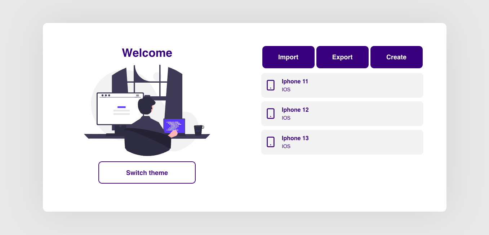
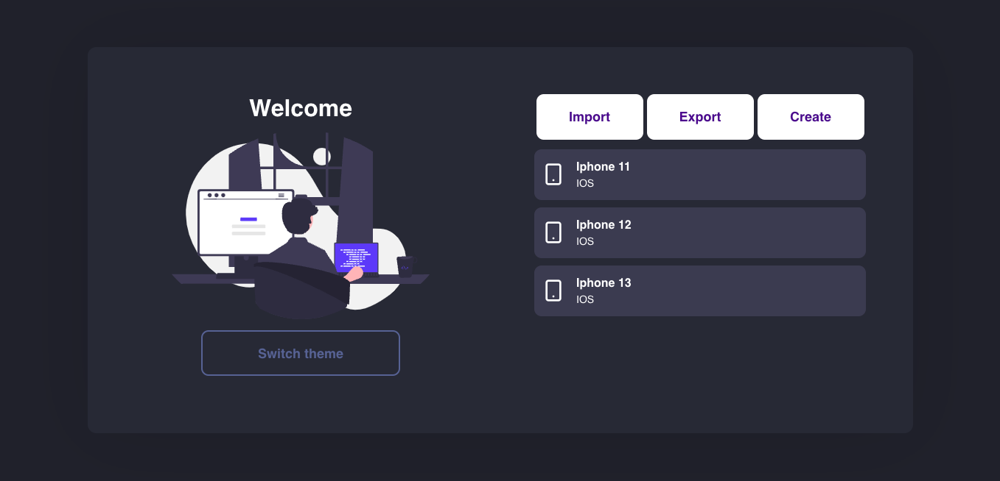
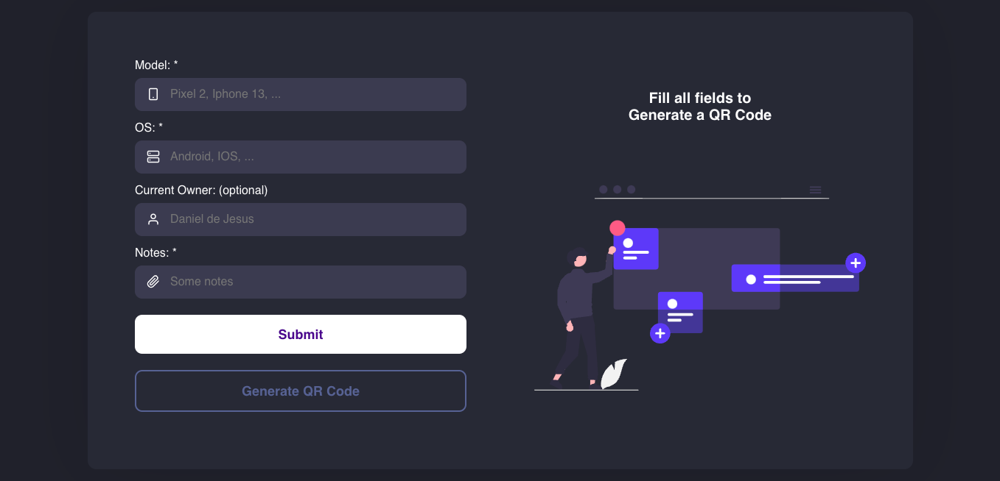

# 📱 Proximus Device Management Web Client
 Proximus Challenge for react native developer

[](https://github.com/danielj06)
[](#)

# :eye: Preview

<div>
  
  
  
</div>

# :pushpin: Table of Contents

* [Features](#brain-features)
* [Installation](#construction_worker-installation)
* [Technologies](#computer-technologies)

# :brain: Features

* List/Add(Multiples)/Update/Delete devices
* Generate QRcode for each device
* Theme switcher
* Import/Export list of devices as .csv

# :construction_worker: Installation

Run this: ``` yarn install ``` or ```npm install``` <br/>
Then: ``` yarn start ``` or ```npx start```

# :computer: Technologies

* Create React App
* Typescript
* Axios
* Styled-components
* Yup
* Formik
* Context Api
* React toastify
* React Router Dom
* React Dropzone
* React Icons

# 📂 Structure

src
 - assets
 - components
 - contexts
 - hooks
 - pages
 - services
 - styles
 - utils
